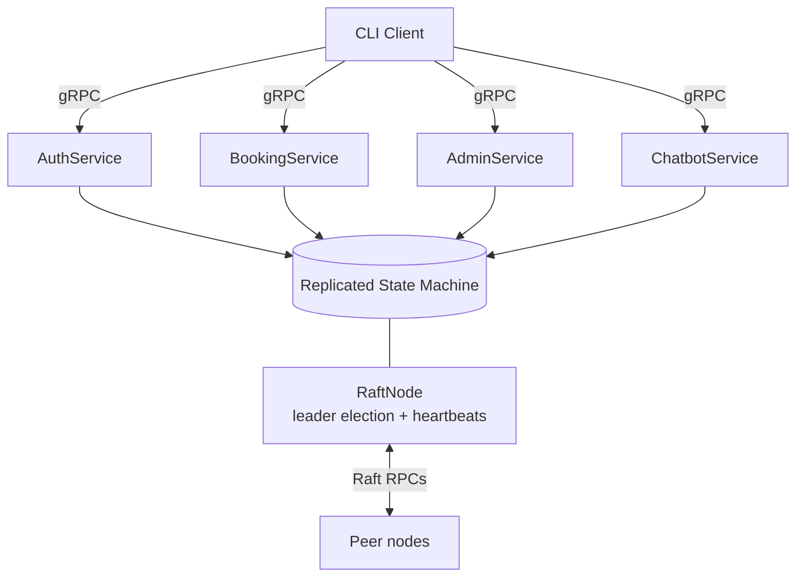

# Distributed Movie Ticket Booking System


A distributed movie-ticket booking system built with **gRPC** and **Protocol
Buffers**, coordinated by a minimal **Raft** consensus layer for leader
election and fault tolerance. It demonstrates concurrent seat reservation
without double-booking, session-based authentication, mock payments and
refunds, and an optional LLM-backed support chatbot with a rule-based fallback.

## Architecture

The server hosts five gRPC services backed by a single in-memory **replicated
state machine**. All state changes flow through the state machine as ordered
commands, so every node applies the same operations in the same order.



| Service          | Responsibility                                             |
|------------------|------------------------------------------------------------|
| `AuthService`    | Login, logout, session validation (TTL-based sessions)     |
| `BookingService` | Seat maps, seat reservation with payment, cancellation     |
| `AdminService`   | Add shows/seats, process refunds (admin-only)              |
| `ChatbotService` | Support answers via rule-based intents or OpenAI           |
| `RaftService`    | Leader election and heartbeats between nodes               |

```
client/            Interactive CLI (gRPC client)
protos/            .proto definitions + generated stubs
server/
  main.py          Server entrypoint, wires up all services
  raft/            RaftNode (consensus) + StateMachine (replicated state)
  services/        gRPC service implementations
scripts/           Helper scripts (compile protos, run server/client)
tests/             Unit tests for the state machine
```

Concurrency safety comes from the state machine holding a lock around every
command, so seat reservations are atomic: a set of seats is checked and then
booked as one indivisible operation, which prevents two clients from booking
the same seat.

## Getting started

### Prerequisites
- Python 3.10+

### Setup
```bash
python -m venv .venv
source .venv/bin/activate        # Windows: .venv\Scripts\activate
pip install -r requirements.txt
chmod +x scripts/*.sh
./scripts/compile_protos.sh      # regenerate stubs for your gRPC version
```

### Run a single node
```bash
./scripts/run_server.sh --port 50051 --node-id node-1
```

In another terminal, start the client:
```bash
./scripts/run_client.sh --addr localhost:50051
```

### Run a 3-node cluster (Raft)
Each node lists its peers as `node-id=host:port`:
```bash
# Terminal 1
./scripts/run_server.sh --port 50051 --node-id node-1 \
  --peers node-2=localhost:50052,node-3=localhost:50053

# Terminal 2
./scripts/run_server.sh --port 50052 --node-id node-2 \
  --peers node-1=localhost:50051,node-3=localhost:50053

# Terminal 3
./scripts/run_server.sh --port 50053 --node-id node-3 \
  --peers node-1=localhost:50051,node-2=localhost:50052
```

The elected leader logs `Became LEADER for term X` and then sends periodic
heartbeats. Killing the leader triggers a new election among the survivors.

## Using the client

Default accounts: `bob` / `secret` (user) and `admin` / `password` (admin).

```
login <user> <pass>                 Log in
listshows                           List shows
seatmap <show_id>                   Show the seat map
reserve <show_id> <amount_cents> <seat...>   Reserve seats and pay
cancel <booking_id>                 Cancel a booking (auto-refund)
addshow <title>                     (admin) Add a show
addseats <show_id> <seat...>        (admin) Add seats
refund <payment_ref>                (admin) Refund a payment
ask <question>                      Ask the support assistant
help                                List all commands
```

### Example
```
> login bob secret
Logged in as user-bob (session a1b2c3d4...).
> reserve show-1 3000 A1 A2
Reservation successful.
  Booking ID:  book_1a2b3c4d
  Payment ref: pay_9f8e7d6c
> seatmap show-1
Row A: A1:X A2:X A3:. A4:. ...
Legend: . = available, X = reserved
```

## Configuration

Set via environment variables or a `.env` file (see `.env.example`):

| Variable         | Purpose                                              | Default            |
|------------------|------------------------------------------------------|--------------------|
| `OPENAI_API_KEY` | Enables the LLM chatbot; falls back to rules if unset | (unset)           |
| `BOOKING_ADDR`   | Default server address for the client                | `localhost:50051`  |

## Testing

Unit tests cover the state-machine logic (reservation, double-booking
rejection, cancellation/refund, admin operations) and need no running server:

```bash
pytest
```

## Tech stack

Python · gRPC · Protocol Buffers · Raft consensus · threading · OpenAI (optional)

## License

Released under the [MIT License](LICENSE).
